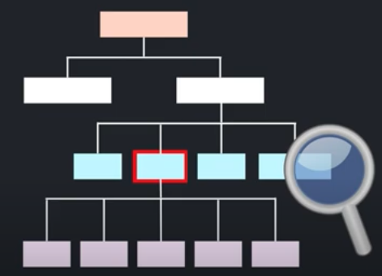

다현쓰 virtual dom 공부
https://youtu.be/gc-kXt0tjTM?si=84xbz40Hu7imszAf 강의 내용 정리

# 1. React의 가상돔 (Virtual DOM)이 뭔가요? (짱 쉬움)
리액트가 수많은 개발자들 사이에서 엄청난 사랑을 받는 이유는 바로
! 빠르기 ! 때문이다.
리액트는 가상돔(Virtual Dom)을 이용해서 보다 효율적으로 원하는 페이지를 빠르게 브라우저에 그려줌

*그리고 프론트엔드 면접 질문으로도 나온다고함

---

## Dom 이란? 
Document Object Model의 약자
Dom이란 웹페이지의 element 구조들을 트리형태로 표현해준 것
 

Dom tree 안에는 각각의 element에 상응하는 node가 들어있음
개발자들은 API를 통해서 돔구조에 접근하고,
원하는 엘리먼트의 구조, 내용, 스타일 등을 입맛대로 수정할 수 있음
이러한 행위를 dom 조작 이라고 함.

ex) 만약 자바스크립트라면 getElementById() 나 querySelector()로 접근하여 수정 가능

---
## Virtual DOM 이란?
리액트는 가상돔을 사용해서 실제돔을 조작하는걸 엄청 빠르게 해줌
가상돔은 실제돔과 같은 내용을 담고 있는 복사본임
그리고 이 가상돔은 자바스크립트 객체 형태로 메모리에 저장되어있음

하지만 가상돔은 실제돔과 다르게 브라우저에 직접적으로 접근할 수 없음
화면에 보여지는 내용도 직접 수정할 수 없음

---
## 👍🏻 그럼 뭐가 좋냐?

웹페이지에서는 돔 조작이 빈번하게 일어남
댓글을 쓰든, 좋아요를 누르든~~ 되게 빈번하게 일어남
돔을 수정해줄 때마다 브라우저가 현재 페이지의 html을 쭉 탐색해서 해당 element를 찾고
해당 element와 자녀 element를 제거함
그리고 새롭게 수정된 element로 교체함

그 후 브라우저에 다시 그려줌
돔조작할때마다 UI를 새롭게 그려주는 작업은 꽤 복잡하고 시간이 많이 걸리는 일임

리액트는 가상돔을 활용해서 빠르게 조작할 수 있도록 도와줌
---
## 👍🏻 리액트가 가상돔 활용하는 방법
리액트는 항상 2개의 가상돔 객체를 가지고 있음
- 첫번째 가상돔은 랜더링 이전의 화면구조를 나타내는 가상돔
- 두번째 가상돔은 랜더링 이후에 보이게 될 화면구조를 나타내는 가상돔

두번째 가상돔을 추가적으로 설명하자면 상태가 바뀔때마다 (UI로 그려지기 전에) 그 상태를 반영하는 새로운 가상돔이 생김.

### 1) Diffing
그리고 첫번쨰 가상돔과 두번째 가상돔을 비교해서 정확히 어느 element들이 변했는지 찾아냄
이러한 과정을 Diffing이라고 부름

### 2) Reconciliation(재조정)
그 후 리액트는 그 바뀐 부분들만 실제 돔에 적용시킴
리액트의 재조정이 굉장히 효율적인 이유는 Batch Update 때문임
Batch Update란 집단으로 바뀐 element를 한번에 적용시키는 것임
만약 리스트안에 10개의 항목이 바뀌었다면 실제돔을 10번 조작하는 것이 아닌 한꺼번에 조작함
-> 화면에 그려주는 작업을 최소화함

---

가상돔에 대한 애니메이션
https://youtu.be/BYbgopx44vo?si=Thi0GJAv2zYxhlg5